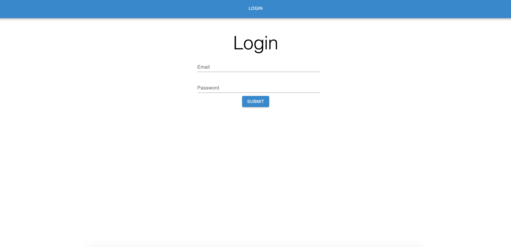

# mhc-assesement

## Technologies Used
- MongoDB
- Mongoose
- Express
- React 
- Redux
- Hooks
- Node.js
- Javascript
- Material UI
- Bcrypt
- Moment 
- Json Web Tokens
- Heroku (deployment)

## Installation & Instructions
- To run locally, clone the repo 
- Ensure you have node.js installed, 
- run npm install
- run npm run dev

## Wireframes

